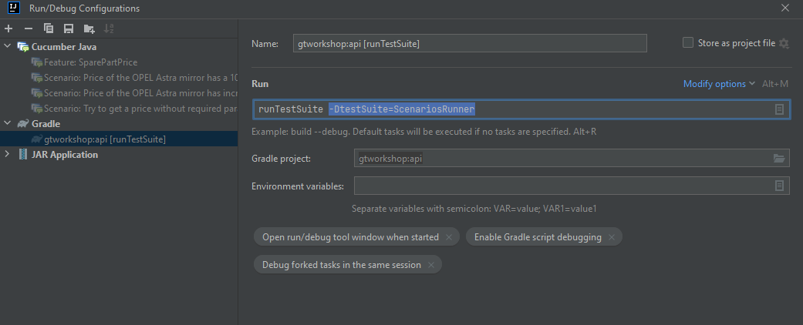

[< back](https://github.com/pmcabrales/gtworkshop/blob/master/README.md?at=master)

# Challenge 3

Finally, we execute the suite and create the report.

## Step 1
Add the ScenariosRunner class.

## Step 2
Add the tags to the features we want to include in our execution and reports. 
Also, tag the steps we want to skip.

## Step 3
Configure the tags in our ScenariosRunner.

## Step 4
Run the gradle task "runTestSuite" adding our runner to the configuration (-DtestSuite=ScenariosRunner).

Now you can check the generated reports.